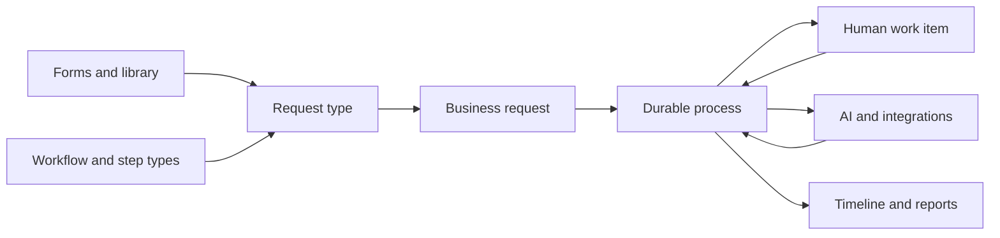

# Workflow and forms backend

This repository is a Python 3.14/FastAPI backend for authored forms, versioned workflows and durable business requests. It covers identity and work groups, client releases, form and definition libraries, workflow authoring, human work items, AI preparation with human supervision, process execution, integrations, notifications, private user media and reporting. The Angular frontend is planned separately; this repository exposes the contracts it will consume.

The main path is: publish a form and workflow, connect them with a request type, save and submit a business request, then follow its pinned process version through automation and human decisions. Published versions are immutable. The server checks permissions, grants and current eligibility again when a command executes.

## Where to start

- [Documentation home](docs/Home.md) provides starting points for users, frontend/backend developers, QA and operators.
- [User handbook](docs/guides/user-handbook.md) explains requests, reviews, corrections and common problems.
- [Frontend walkthrough](docs/guides/frontend-journey.md) connects login to request completion with framework-neutral TypeScript and checked examples.
- [Project and API overview](docs/project-overview.md) defines the domain vocabulary and module ownership.
- [Full workflow roadmap](docs/roadmap/full-workflow.md) gives a staged purchase approval example for frontend design, including a human approval after AI preparation.
- [Response DTO reference](docs/reference/responses/index.md) lists successful response schemas by API topic, with generated field tables and reviewed examples where available.
- [Swagger/OpenAPI](http://localhost:8000/api/v1/swagger-ui) is the current machine-readable API contract. ReDoc is at `/api/v1/redoc`, JSON at `/api/v1/openapi.json`, and YAML at `/api/v1/openapi.yaml`. Schema responses honor `Accept-Language` for English/Farsi descriptions.

## Architecture

Each app in `src/apps/` owns its domain. Modules use `domain` for entities/DTOs and business contracts, `application` for use cases, `data` for persistence adapters where needed, and `presentation` for HTTP routes. Shared auth, database/session, history, localization and task infrastructure live in `src/core/`; transport and formatting helpers live in `src/utils/`. Alembic revisions are in `src/migrations/`.

Large domains keep focused `domain/entities/` and `domain/dtos/` modules. Their `domain/entity.py` and `domain/dto.py` modules remain import-compatible facades; existing imports and migration metadata continue to use those public paths. New code should import the smallest focused module when it makes ownership clearer.



## Local setup

1. Run `mise install` for Python, uv and quality tools, then `mise run setup` to sync local dependencies and install hooks.
2. Copy the development templates to private local files (existing files are preserved), then
   review the values before starting services:

   ```bash
   for name in backend postgres cache broker s3 pgadmin; do
     test -e ".envs/.$name" || cp ".envs/examples/.$name" ".envs/.$name"
   done
   ```

   `docker-compose.yml` reads `.envs/.backend`, `.postgres`, `.cache`, `.broker`, `.s3` and
   `.pgadmin`. These local files are ignored by Git. The tracked `.envs/examples/` values are
   development placeholders; replace them before deployment. Existing database/storage volumes
   retain their original credentials, so keep local files matched to those volumes.
3. Run `mise run up`, then `mise run migrate` against the local database. Open [Swagger UI](http://localhost:8000/api/v1/swagger-ui) after backend startup. Use `mise run logs` for service output.

The stack uses PostgreSQL, a Redis-compatible cache, an AMQP broker, S3-compatible object storage, API and Celery workers, Flower, and OpenTelemetry collector/Jaeger. Liveness and readiness endpoints expose dependency status. Swagger authorization uses the configured OAuth client and a seeded local account where available.

## Testing

`mise run check` is the complete local success gate. It runs lock consistency, format, lint, utility docstrings, Ty, Bandit/detect-secrets, utility doctests, the default pytest suite, the disposable PostgreSQL [full workflow regression](docs/testing/full-workflow-regression.md), and all-file pre-commit checks in a stable sequence. Configure `.envs/.backend` and `.envs/.postgres` with matching database credentials. If local PostgreSQL on port 5432 is unavailable, the flow runner starts the Compose `postgres` service and waits for readiness. Docker must be available for automatic startup; set `FLOW_TEST_AUTOSTART=0` to manage the service yourself. Custom ports always require manual startup. `mise run flow-test` runs only the full workflow case. `mise run fmt` and `mise run lint-fix` apply formatting and lint fixes. Run `mise run coverage` for the optional coverage report.

Service integration tests are opt-in and need disposable migrated PostgreSQL, cache, broker and S3 services. For example, `RUN_INTEGRATION=1 uv run pytest -m integration tests/integration/test_services.py` runs service probes. The migration round-trip test is destructive to its configured database: run `RUN_MIGRATION_INTEGRATION=1 uv run pytest tests/integration/test_migrations.py` only against an empty disposable database.

The secret check scans source, tests, scripts, Compose files and development templates, including
untracked files. `.secrets.baseline` records reviewed fixture values and identifiers by file and
fingerprint. New findings fail the check; review them individually rather than regenerating the
baseline blindly. Private `.envs/` files remain outside version control.

## Package installation

`uv sync --locked` installs runtime dependencies and local `dev` tools. The production Docker builder uses `uv sync --locked --no-default-groups --no-install-project --active` and verifies the result with `uv pip check`; the runtime image contains only that virtual environment and the copied application source. Dependency changes require a new lockfile and image rebuild. See [dependency policy](docs/operations/dependencies.md) for the exact groups, upgrade and deployment checks.

## Operations

Set `LOG_OUTPUTS` to a JSON list of `console`, `file` and/or `otel`; for example `LOG_OUTPUTS=["console","file"]`. SQL console formatting can be disabled with `SQL_PRETTY_LOGS=false`. [Observability](docs/operations/bpms-observability.md) and [safeguards](docs/operations/bpms-safeguards.md) document recovery, retention and rollout behavior. The details below cover the task delivery implementation and local troubleshooting.

The application explicitly uses OTLP **gRPC** exporters for traces, metrics and logs. In Compose,
`OTEL_EXPORTER_OTLP_ENDPOINT` must point to `http://otel-collector:4317`; the `http://` scheme
here selects plaintext gRPC. Port 4318 is the Collector's separate OTLP/HTTP receiver.
OpenTelemetry's own diagnostics stay in configured console/file outputs and are excluded from
OTLP log export to prevent recursion and export-failure feedback. Structlog formatter metadata
(`_logger`, `_name`) is removed from a copy used only by the OTLP handler; console/file formatting
retains its original record. This avoids invalid `logging.Logger` attribute warnings.

FastAPI's native telemetry auto-configuration is explicitly disabled in `src/main.py` because
`core.observability` already owns exporters and request instrumentation. Otherwise FastAPI adds
HTTP/protobuf exporters at lifespan startup, appends `/v1/traces` and `/v1/logs` to the gRPC endpoint,
and produces `Connection aborted`, `ConnectionResetError` or binary `BadStatusLine` errors.
Setting a gRPC protocol variable alone is not the fix: native auto-configuration supports HTTP.

If these errors recur, verify the running app includes the explicit `telemetry` configuration
and inspect any additional exporter initialization. Rebuild and recreate the affected services:

```bash
docker compose up -d --build --force-recreate otel-collector backend worker reporting-worker scheduler
docker compose logs --since=2m backend otel-collector
```

The Collector configuration is copied into its image, so configuration changes require rebuilding
it too. If failures persist, inspect Collector startup errors and verify its gRPC listener is
reachable from the backend container. Increasing retry timeouts does not correct a protocol mismatch.

---

## Celery lifecycle and delivery

Workers use the prefork pool with a **600-second soft limit** and a **1200-second hard limit**.
Each registered task runs inside `core.task_lifecycle.task_lifecycle`, which logs acquisition,
start, success/failure/retry, and state release. Its `finally` block releases failed attempts,
closes temporary cache clients, and restores logging context. Worker shutdown closes its persistent
async I/O loop and database pool. Use `core.celery_runtime.run_async()` for asynchronous database
work inside synchronous tasks so connections stay on the same event loop.

A hard kill cannot execute Python cleanup. Running claims expire after the task's hard limit plus
`CELERY_TASK_LEASE_GRACE_SECONDS` (60 seconds by default). The scheduler recovers expired claims
and marks unfinished execution records failed. If cleanup encounters an unavailable database,
it logs the failure and the same expiration mechanism releases ownership. Hard timeouts are
terminal; unexpected worker loss permits redelivery. Soft timeout exceptions propagate after cleanup.

Successful results are retained in PostgreSQL for `CELERY_IDEMPOTENCY_TTL_SECONDS` (24 hours by
default), with a cache of completed results. The idempotency key is scoped to the task name and
defaults to the Celery task ID. Set the `idempotency_key` message header, or the same field on
`POST /api/v1/tasks/run`, to deduplicate separate submissions. A duplicate returns the stored
result; a running duplicate waits for its current lease. Ownership tokens prevent old attempts
from releasing a replacement worker's claim. Cache outages fall back to PostgreSQL.

Manual submissions, administrative retries, and scheduler occurrences are committed to a
PostgreSQL outbox before RabbitMQ publication. **Keep the scheduler running**: it drains that
outbox as well as polling schedules. A failed publication remains pending with backoff. A crash
after publication replays the same task ID, allowing the worker to deduplicate it. One-off schedule
disabling and message creation happen in the same transaction. Periodic idempotency keys include
the occurrence number so later scheduled runs remain independent. Revocation removes an unpublished
outbox message before sending the worker control command.

Business code can stage work in its own database transaction:

```python
from apps.tasks.application.outbox import enqueue_task
from core.deps import SessionFactory


async def enqueue_health_check() -> str:
    async with SessionFactory() as session, session.begin():
        message = enqueue_task(
            session,
            "system.ping",
            headers={"idempotency_key": "health-check:example"},
        )
    return message.task_id
```

The caller owns commit/rollback; `enqueue_task` does not publish or commit. Delivery is at least
once: a crash between an external side effect and recording success can still repeat that effect.
Use the same operation key with downstream services, or enforce uniqueness in the business
transaction. Schedule `system.cleanup_task_history` regularly to prune bounded batches of disposable
terminal task history, expired completed claims, and published outbox rows. Pending messages, BPMS
task evidence, referenced executions and configuration audit are retained.

Compose waits for healthy PostgreSQL, cache, and broker services before starting the workers and
scheduler. The general worker consumes the default and BPMS automation queues. A separate reporting worker consumes
only the `reporting` queue with concurrency fixed at one, preventing simultaneous report generation
from competing for memory and database resources. Dead-letter queues remain available for
inspection. Workers recycle after 100 tasks or 256 MiB of resident memory (checked between tasks).
Compose allows 21 minutes for graceful worker shutdown. These defaults can be changed using
`CELERY_WORKER_MAX_TASKS_PER_CHILD` and `CELERY_WORKER_MAX_MEMORY_PER_CHILD` (KiB). If task hard
limits are increased, increase Compose's worker `stop_grace_period` as well.

Celery results default to `CACHE_DSN`; optionally set `CELERY_RESULT_BACKEND` to a separate Redis
URL. Control/event queues are exclusive to support RabbitMQ 4.3. The former `rpc://` result backend
uses transient non-exclusive queues that RabbitMQ 4.3 rejects by default; see
[RabbitMQ queue compatibility](https://www.rabbitmq.com/docs/4.2/queues).

Apply the new migration before starting the updated backend, worker, and scheduler:

```bash
mise run migrate
mise run up
```

The lifecycle/outbox integration tests require migrated, disposable PostgreSQL, Redis-compatible
cache, and RabbitMQ services configured through the normal environment variables. The worker tests
launch their own worker on a unique queue and use short probe timeouts:

```bash
RUN_CELERY_INTEGRATION=1 uv run pytest \
  tests/integration/test_celery.py tests/integration/test_celery_worker.py
```

---

## 🧪 Testing

Run all tests:

```bash
mise run test
```

Run with coverage:

```bash
mise run coverage
```

Real PostgreSQL, Dragonfly, RabbitMQ/Celery, and MinIO tests are marked `integration` and remain
disabled in the fast suite. Run them against disposable Compose infrastructure with:

```bash
RUN_INTEGRATION=1 uv run pytest -m integration tests/integration/test_services.py
```

The Alembic round-trip test intentionally destroys the schema in its configured database. Point
the environment at a disposable empty database before running:

```bash
RUN_MIGRATION_INTEGRATION=1 uv run pytest tests/integration/test_migrations.py
```

Output:

* Terminal coverage report
* HTML report → `htmlcov/index.html`

---

## 📊 Benchmarking

Run performance benchmarks:

```bash
mise run benchmark
```

---

## 🔐 Security

Run security checks:

```bash
mise run security
```

Includes:

* Bandit (static security analysis)
* Detect-secrets (secret scanning)

---

## 🧹 Code Quality

### Format code

```bash
mise run fmt
```

### Lint code

```bash
mise run lint
```

### Fix lint issues

```bash
mise run lint-fix
```

### Type check

```bash
mise run typecheck
```

### Full check

```bash
mise run check
```

---

## 🐳 Docker Workflow

### Start everything

```bash
mise run up
```

### Stop everything

```bash
mise run down
```

### Rebuild

```bash
mise run rebuild
```

### Logs

```bash
mise run logs
```

### Shell into backend

```bash
mise run shell
```

---

## 🗄️ Database

The migration history has exactly two revisions:

1. `src/migrations/versions/0001_schema.py` creates all current application tables, history
   tables, indexes, constraints, functions and PostgreSQL guards. It inserts no rows.
2. `src/migrations/versions/0002_required_data.py` installs the built-in step/operation handler
   contracts and ports (including all deployed extension handlers), permission definitions and two
   maintenance schedules. An initial admin
   is created only when both `INITIAL_ADMIN_USERNAME` and `INITIAL_ADMIN_PASSWORD` are configured.
   Demo data, roles, user assignments and integration credentials remain explicit setup actions.
   Operations such as `connection.status` are code registries, not separately persisted records.

Fresh databases use `alembic upgrade head`. To install only tables, use
`alembic upgrade 0001_schema`. Data-only downgrade is refused because published handlers can
already be referenced by workflows; full `alembic downgrade base` removes application tables
and is intended only for disposable databases or an explicitly approved teardown.

**Existing databases on the old chain need a transition before deploying this checkout.**
The new revision IDs deliberately reject old revision markers without replaying DDL. Keep the
previous migration files available outside this checkout for upgrading an old database to its
previous head first. Back up the database, rehearse the transition on a restored copy, verify
its schema/guards against the complete new baseline, reconcile missing permission definitions
without changing grants, and verify catalogs and application checks before an operator changes
its revision marker to the new head. Do not stamp an incomplete schema or rerun required seed
inserts over retained immutable catalogs. This change does not reset or stamp any project database.
See [DB-002](docs/changes/DB-002.md) for verification and compatibility details.

### Run migrations

```bash
mise run migrate
```

### Create migration

```bash
mise run makemigrations -m "your message"
```

### Check migrations

```bash
mise run db-current
mise run db-history
```

---

## 🧠 Observability

This project includes full distributed tracing:

* OpenTelemetry SDK
* Separate API, scheduler, general-worker, and reporting-worker services in Jaeger
* FastAPI and PostgreSQL/SQLAlchemy request spans
* Scheduler ticks, outbox publication, RabbitMQ delivery, and Celery worker pickup/execution spans
* Dragonfly/Redis and MinIO/S3 **client-call** spans
* OTEL Collector forwarding application traces to Jaeger

An authenticated API request that queues a task keeps its trace context in the
transactional outbox. The publisher restores it before sending the message, and
the worker continues the same trace. Search Jaeger span tags for
`app.user.username=<username>` (or `app.user.id=<UUID>`); only successfully
authenticated requests and tasks queued on their behalf carry this identity.
The independent `scheduler.tick` trace shows leadership, schedule count, and
the number of published messages. Worker spans include `task.picked_up`, queue,
task name, retry count, and task ID. Passwords, tokens, and task arguments are
not added as trace attributes.

PostgreSQL, RabbitMQ, and Dragonfly also have Collector **metrics** receivers;
those metrics appear at the Collector Prometheus endpoint (`localhost:8889`),
not in Jaeger. The MinIO community image and pgAdmin do not provide a native
trace stream in this deployment: S3 activity is traced from the instrumented
API/worker client, while pgAdmin's separate admin-UI activity is not traced.

BPMS runtime metrics use the `bpms.*` namespace. Their bounded labels, initial service targets,
redaction rules, and operator actions are documented in
[`docs/operations/bpms-observability.md`](docs/operations/bpms-observability.md).

Access Jaeger:

👉 [http://localhost:16686](http://localhost:16686)

---

## 🧾 Commit Workflow

This project enforces **Conventional Commits**.

### Interactive commit

```bash
mise run commit
```

### Version bump + changelog

```bash
mise run bump
```

---

## 🧪 CI Pipeline (Local)

Simulate CI locally:

```bash
mise run ci
```

Runs:

* formatting
* linting
* typing
* tests
* security checks

---

## 🧰 Tech Stack

| Layer         | Tech                   |
| ------------- | ---------------------- |
| API           | FastAPI                |
| DB            | PostgreSQL             |
| ORM           | SQLAlchemy + SQLModel  |
| Migrations    | Alembic                |
| Observability | OpenTelemetry + Jaeger |
| Validation    | Pydantic v2            |
| Typing        | Ty                     |
| Linting       | Ruff                   |
| Testing       | Pytest                 |
| Runtime       | Uvicorn                |
| Packaging     | uv                     |
| Dev UX        | mise                   |

---

## 📦 Project Philosophy

This template is built around:

* **Predictable structure**
* **Zero hidden magic**
* **Fast local iteration**
* **Production parity with Docker**
* **Strict typing + linting**
* **Observability by default**

---

## 🧪 Example Endpoint Structure

```bash
users/
├── domain/        → pure logic
├── application/   → use cases
├── data/          → DB layer
└── presentation/  → API routes
```

Each layer is independent → easy testing, scaling, and refactoring.

---

## 🧼 Notes

* No global dependencies (everything via `uv`)
* No Node required
* Fully reproducible environments
* Designed for scaling into microservices


### Response presentation and localization

JSON API responses use the shared Go presenter contract. Successful payloads are
returned as `{"success": true, "request_id": "...", "error": null, "code": 200, "data": ...}`.
Create responses use code 201; accepted task submissions use 202. Completed operations
that previously returned empty HTTP 204 responses now return HTTP 200 with code 204
and `data: null`, matching the presenter contract. Media downloads are returned only after
their stored checksum has been verified.

Errors use the same fields with `success: false`, a translated `error`, a stable
application error number in `code`, and `data: null`. The HTTP status remains separate
(e.g. HTTP 401 with application code 2001). Unexpected errors never expose exception
messages or request inputs. `request_id` matches the `X-Request-ID` response header.

- Presenter: `src/utils/presenter.py` (`success_response`, `page_response`, `error_response`).
- Handler registration: `configure_exception_handlers(app)` in `src/utils/exception_handlers.py`.
- Error enums: `src/utils/errors/`, grouped into common, authentication, media, and infrastructure errors.
- Gettext catalogs: `src/locales/<language>/LC_MESSAGES/messages.po`.
- Translation entrypoint: `src/core/i18n.py`; application code can use `from core.i18n import _`.
- Language resolution supports `en`, `fa`, regional variants,
  weighted `Accept-Language` headers, and legacy `ENGLISH`/`PERSIAN` names. Unsupported
  languages fall back to English.

Each error enum contains `(number, English gettext message)`. The number remains the stable API
identity. Mark new public text with `_()`, extract it, update the catalogs, and compile them:

```bash
mise run i18n-extract
mise run i18n-update
mise run i18n-compile
```

The current catalog replaces legacy error numbers that duplicated HTTP statuses. Once a
number is published, do not reuse or renumber it. Application error numbers use
1000–1999 for common failures, 2000–2999 for authentication, 3000–3999 for media,
and 4000–4999 for infrastructure. Numbers 5000–8999 are reserved for business rules
that require a distinct client action.

PostgreSQL SQLSTATE values remain internal diagnostic identifiers. The HTTP handler
maps only known client conflicts and temporary database failures to public codes;
unknown database errors return application code 1099 with HTTP 500. The full code
allocation and mapping rules are in `.agents/skills/error-code-design/references/catalog.md`.

```python
return error_response(request, AuthError.INVALID_TOKEN, status_code=401)
return success_response(request, select_options("asc", "desc"))
```

The local backend environment seeds a development superuser during the initial migration with
`INITIAL_ADMIN_USERNAME` and `INITIAL_ADMIN_PASSWORD`. Leave both variables unset outside local
development to skip the seed.

Select options have exactly `value` and `title` fields and are passed as success `data`:
`[{"value": "asc", "title": "asc"}, {"value": "desc", "title": "desc"}]`.

### Read-through caching

`BaseCacheRepository` provides Redis-compatible cache-aside reads with a 30-minute default
TTL. Resource caches use a versioned namespace: a successful create, update, delete, restore,
or other ORM write advances the namespace after the database commit. Later detail and page
requests miss the old namespace, reload from PostgreSQL, and cache the fresh result. Old keys
expire naturally, so invalidation is constant-time and does not scan Redis.

User admin search and detail endpoints currently use `UserCacheRepository`. They cache only
validated `UserDTO` and `Page[UserDTO]` payloads, so password hashes are never written to the
cache. Redis read or invalidation failures fall back to PostgreSQL and are bounded by short
connection timeouts. Repositories can override `ttl_seconds` when their freshness requirements
differ from the 30-minute default.

### Search DTO contract

Admin user and history search requests use the shared `SearchRequest` model:

```json
{
  "filters": [{"field_name": "username", "operation": "contains", "value": "ada"}],
  "sort_orders": [{"multi_field": ["username", "created_at"], "operation": "desc"}],
  "page": 1,
  "size": 20
}
```

Use `field_name` for a single sort field or `multi_field` for several. Supported filter
operations are `equal`, `notEqual`, `startWith`, `endsWith`, `contains`, `notContains`,
`between`, `isNull`, `isNotNull`, `gt`, `gte`, `lt`, `lte`, `in`, and `nin`. Operators
and values are validated against the DTO field type. Null checks omit `value`;
`in` and `nin` require nonempty lists, and `between` requires exactly two values.
String matching treats `%` and `_` literally. Unknown/private fields are rejected.
Pages begin at 1; size defaults to 20 and is limited to 100. Stable tie-breaker sorting
keeps pages deterministic. The old `ordering` and `page_size` request fields are replaced
by `sort_orders` and `size`. History filters now use `filters` with fields such as
`operation`, `modifier_type`, and `modifier_id`.

Paginated responses use `result`:

```json
{
  "success": true,
  "request_id": "...",
  "error": null,
  "code": 200,
  "result": {
    "items": [],
    "page": 1,
    "size": 20,
    "total": 0,
    "total_pages": 0
  }
}
```


### Developer SQL output

FastAPI SQL console logs use Rich query panels, PostgreSQL syntax highlighting, and
`sqlparse` indentation by default. Parameter and transaction records have compact labels.
Colors follow terminal support (including the local backend TTY); plain-text panels
remain readable in captured logs. Statements retain
bound placeholders, and SQLAlchemy logs the parameter values separately. JSON file
logs retain the original statement. Set `SQL_PRETTY_LOGS=false` in `.envs/.backend`
to use the regular console format. Worker and scheduler SQL echo remains disabled.

The local `/start` script uses `fastapi dev`, including FastAPI's default startup output and
automatic reload. Rebuild the backend image after changing dependencies or startup scripts:
`docker compose up -d --build backend`.

The backend image installs production dependencies from `uv.lock` with `uv sync --locked --no-default-groups --no-install-project --active`;
its build fails if `pyproject.toml` and the lockfile disagree. Run `uv lock` when changing
dependencies, then rebuild the backend image. Developer dependency groups are not installed
in the image.


### BPMS operational safeguards

Superuser recovery, retention policy, consistent backup/restore and worker rollout procedures are
in [the safeguards runbook](docs/operations/bpms-safeguards.md). Recovery uses a required reason
code and transactional duplicate-command protection. Business audit and BPMS-linked task records
are retained. Rebuild the backend image to activate general-worker consumption of the BPMS
automation queue. SQL logging hides bound parameters. No new migration is required.

### Trusted workflow step extensions

Deploy custom step classes under `src/apps/step_types/extensions/` in both API and worker images.
Startup creates matching draft catalog versions; a workflow administrator publishes each version
before it can be selected or executed. See the [extension guide](docs/guides/step-extensions.md)
for a copyable class, supported modes, version changes and deployment checks.
