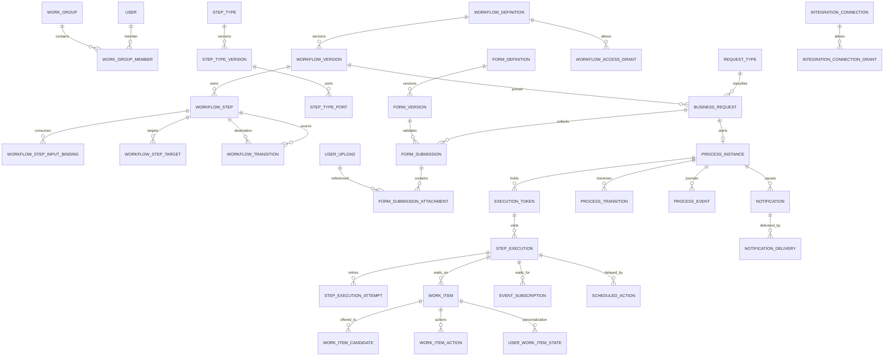

# BPMS architecture and relational contract (BPMS-001)

Status: **historical design blueprint**, retained for rationale. This is not the current deployed
schema, an API reference, or instructions for applying migrations. For implemented behavior use
the [project overview](../project-overview.md), [frontend guide](../guides/frontend-journey.md)
and live OpenAPI. [DB-001](../changes/DB-001.md) consolidated the migration chain into
`b13a0c7d2e44_initial_schema.py`; see the database section of the [current README](../../README.md).
Target: this repository's PostgreSQL/SQLModel conventions; single tenant, normalized relations,
uppercase database identifiers and UUIDv7. Exact public routes and DTOs belong to the dependent
implementation tasks. The original revision `d28db6215a2b` mentioned below has been superseded.
Data-schema dialect is pinned to [JSON Schema Draft 2020-12](https://json-schema.org/draft/2020-12);
render-schema validation is a separate BPMS-defined contract, not a JSON Schema UI standard.

## Ownership and interfaces

The successor [form package v2 contract](form-package-v2.md) defines the future multilingual,
reusable envelope. Existing published `bpms.render/1` forms remain governed by their stored
documents and checksum; the successor contract does not change them.

| Module (owner) | Small application interface | Owns / does not own |
| --- | --- | --- |
| UMS and work groups | `eligible_users(group_id)`, `is_active_member(user_id, group_id)` | `USER`, roles/permissions and group membership; roles authorize operations, not workflow routing. |
| Form builder | `validate_draft`, `publish_form`, `get_published_form`, `validate_submission` | Data/render schemas and version validation; media bytes remain with the existing media module. |
| Workflow definitions | `validate_graph`, `publish_workflow`, `can_view`, `can_start` | Type catalogs, graph, grants and typed bindings; never runs steps. |
| Requests | `create_draft`, `save_draft`, `submit_request` | Request-type contract, draft data, requester and version/priority snapshots; delegates execution to runtime in the same transaction. |
| Runtime | `start(request_id, command_key)`, `resume(wait_id, result, command_key)`, `pause`, `cancel` | Tokens, attempts, input/output validation and transitions; never edits published definitions. |
| Cartable | `list_visible`, `claim`, `release`, `complete`, `forward` | Candidate eligibility, claimant, human form and user-specific read/pin/archive; completing calls runtime resume in the same transaction. |
| Events/timers | `register_wait`, `deliver_event`, `claim_due`, `expire_wait` | Durable subscriptions/schedules; invokes the one runtime resume interface, reusing scheduler lease/outbox infrastructure. |
| Integrations/notifications | `resolve_connection`, `enqueue_delivery` | Secret references and delivery records; no credentials in workflow JSON, outbox or execution snapshots. |

Application interfaces own transaction orchestration; HTTP adapters use `BaseDTO`, snake_case JSON,
opaque `ref_id`, existing authorization/error/localization and search conventions. Registered
step handlers, expression evaluator, secret resolver, object storage and delivery channels are
internal seams with bounded interfaces; designers cannot supply Python imports, arbitrary network
URLs or executable code. Background dispatch uses existing `TASK_OUTBOX`/Celery; its
`TASK_EXECUTION` is infrastructure history, never a BPMS `STEP_EXECUTION`. A process timeline is
written with the owning transaction, not inferred from CRUD history. Read projections combine
published graph + live tokens + executions; return **all** current positions, not one current step.

## Shared relational rules

Notation below: `!` NOT NULL, `?` NULL; `PK`, `UQ`, `CK` and `IX` denote keys, uniqueness, checks
and initial indexes. All unspecified UUID identifiers are real FK-backed UUIDs, not arrays of IDs.
All FK actions are `ON UPDATE RESTRICT, ON DELETE RESTRICT` **unless explicitly overridden**;
there is no physical deletion of referenced published definitions or runtime history. All
non-junction tables have `ID UUID PK DEFAULT uuidv7()` unless a different PK is shown. Times are
UTC `TIMESTAMPTZ`; JSON values are `JSONB` with application-level schema validation; keys/codes
are bounded `VARCHAR`, messages `TEXT`. `CK(status)` means a CHECK against the enumerated states
in the lifecycle section (plus table-specific states noted below). `CK(priority)` means integer
between 0 and 9; 9 is highest. Every FK has an index, satisfied by the listed composite index if
its FK column is first; otherwise add a single-column FK index in the migration. This rule also
applies to both legs of composite keys and to existing UMS/media FKs. `IX(active...)` is partial
on active/non-deleted rows. Do not add JSONB GIN indexes until a measured query needs one.

`BaseEntity` means `ID`, `VERSION=1`, `CREATED_AT!`, `UPDATED_AT?`, `DELETED_AT?` and SQLAlchemy
optimistic locking. Soft deletion is **allowed only** on group/configuration roots and unsubmitted
drafts; for published versions, graph children, submitted forms, requests and live runtime rows,
`DELETED_AT` stays NULL (enforce with status-aware CHECK on submitted/terminal rows, and an
unconditional CHECK for runtime rows). Mutable runtime aggregates can use `BaseEntity` for optimistic
locking but do not use generic soft-delete CRUD. Tables marked `E` below inherit it; tables marked `A`
use explicit ID and created/occurred time and prohibit UPDATE/DELETE (enforce with DB privileges
or trigger as well as application rules); tables marked `J` have the indicated composite key;
tables marked `C` have an explicit UUID PK and own lifecycle columns, no BaseEntity. Generated
history (`H`) is limited to eight configuration roots listed below; published graph-child edits
are prohibited. Draft graph changes update the workflow version checksum (captured in its history)
and publish as a validated snapshot; parent field history does **not** capture child diffs. If
full draft edit provenance is required, BPMS-007 must add a separate audited operation log.
Group membership and workflow/connection grant mutations must additionally record actor, target,
capability change and request correlation in the existing `AUTH_AUDIT_EVENT` table in the same
transaction; its details are allowlisted and never contain secret material.

`H` rows follow existing `create_history_table`: UUID PK, `ENTITY_ID!` FK RESTRICT, actor,
changed time, operation, optional correlation metadata and FROM_/TO_ field snapshots. Eight:
`WORK_GROUP_HISTORY`, `FORM_DEFINITION_HISTORY`, `FORM_VERSION_HISTORY`,
`STEP_TYPE_HISTORY`, `WORKFLOW_DEFINITION_HISTORY`, `WORKFLOW_VERSION_HISTORY`,
`REQUEST_TYPE_HISTORY`, `INTEGRATION_CONNECTION_HISTORY`. Audit generation must redact
secret-like columns, and each history table indexes `(ENTITY_ID, CHANGED_AT)` and its correlation
fields. Runtime `PROCESS_EVENT`, `PROCESS_TRANSITION`, `WORK_ITEM_ACTION` are explicit, not
generated histories. Other mutable child changes require an owning transaction event/audit entry;
draft graph edit events may be stored in the existing history context, but full draft graph diffs
are **not** guaranteed by the eight generated tables.

## ER relationships

`o{` is zero-to-many, `o|` zero-to-one. Additional optional/alternative actor FKs and all
cross-links are specified in the dictionary. M:N user/group access is represented by candidate,
grant or membership rows, never a role ID or JSON array.

## Table dictionary (34 domain tables)

Every row lists non-inherited columns; `FK -> TABLE` is explicit. `UQ` constraints are normally
partial on `DELETED_AT IS NULL` for soft-deletable entities. For all other rows they are ordinary
unique constraints unless a partial predicate is given. Nullable columns have a reason in the
column text. A state/name type is bounded and backed by a CHECK or registered catalog where noted.

### Groups and forms (6)

1. `WORK_GROUP` **E,H**: `CODE!`, `NAME!`, `IS_ACTIVE! DEFAULT true`, `DESCRIPTION?`. UQ active
   `CODE` (including inactive but non-deleted groups, to avoid code reuse while referenced); IX
   `(IS_ACTIVE,CODE)` for selectors. Deletion blocked while referenced by any grant/candidate.
2. `WORK_GROUP_MEMBER` **J**: PK `(WORK_GROUP_ID!,USER_ID!)` FK -> `WORK_GROUP`,`USER`;
   `IS_ACTIVE!`, `JOINED_AT!`, `LEFT_AT?` (only inactive), `ADDED_BY_USER_ID?` FK -> `USER` (system
   import), `UPDATED_AT?`; CK `(IS_ACTIVE AND LEFT_AT IS NULL) OR (NOT IS_ACTIVE)`; IX
   `(USER_ID,IS_ACTIVE,WORK_GROUP_ID)` and FK `ADDED_BY_USER_ID`. Membership changes lock the row;
   no duplicate historical membership row, deactivate/reactivate instead; physical deletes RESTRICT
   while group/user referenced, ordinary unlink only if never used.
3. `FORM_DEFINITION` **E,H**: `CODE!`, `NAME!`, `OWNER_USER_ID!` FK -> `USER`, `IS_ACTIVE!`;
   UQ active `CODE`; IX `(OWNER_USER_ID,CREATED_AT)`.
4. `FORM_VERSION` **E,H**: `FORM_DEFINITION_ID!` FK -> `FORM_DEFINITION`, `NUMBER! >0`,
   `STATUS!`, `DATA_DIALECT!`, `RENDER_DIALECT!`, `DATA_SCHEMA!`, `RENDER_SCHEMA!`,
   `CHECKSUM?` (null only in draft), `PUBLISHED_BY_USER_ID?` FK -> `USER`, `PUBLISHED_AT?`;
   UQ `(FORM_DEFINITION_ID,NUMBER)`; CK status/publication fields consistent; IX
   `(FORM_DEFINITION_ID,STATUS,NUMBER DESC)` and publisher FK. Schemas are immutable after publish.
5. `FORM_SUBMISSION` **E**: `BUSINESS_REQUEST_ID!` FK -> `BUSINESS_REQUEST`, `FORM_VERSION_ID!`
   FK -> `FORM_VERSION`, `STEP_EXECUTION_ID?` FK -> `STEP_EXECUTION` (null on start form),
   `SUBMITTED_BY_USER_ID?` FK -> `USER` (null in draft), `STATUS!`, `DATA! DEFAULT '{}'`,
   `SUBMITTED_AT?`; CK submitted fields/status consistent; UQ one start submission per request
   `WHERE STEP_EXECUTION_ID IS NULL AND STATUS='SUBMITTED'`, UQ `(STEP_EXECUTION_ID)` for one
   submitted human form `WHERE STEP_EXECUTION_ID IS NOT NULL AND STATUS='SUBMITTED'`; IX
   `(BUSINESS_REQUEST_ID,CREATED_AT)` and form/actor/step FKs. Drafts may be superseded; only a
   submitted start form may start a process.
6. `FORM_SUBMISSION_ATTACHMENT` **E**: `FORM_SUBMISSION_ID!` FK -> `FORM_SUBMISSION`,
   `FIELD_PATH!`, `USER_UPLOAD_ID!` FK -> `USER_UPLOAD`, `ADDED_BY_USER_ID!` FK -> `USER`,
   `CONTRIBUTING_GROUP_ID?` FK -> `WORK_GROUP` (null for direct contributions),
   `POSITION! >=0`, `CAPTION?`, `STATUS!` CHECK `ACTIVE/REMOVED`; UQ
   `(FORM_SUBMISSION_ID,FIELD_PATH,POSITION) WHERE STATUS='ACTIVE'`; duplicate-upload policy is
   validated under the parent lock according to pinned form options (a global unique asset key
   would wrongly disallow forms that permit duplicates); IX `(USER_UPLOAD_ID)` and remaining FKs.
   Reorder updates all positions under parent row lock in one transaction, staging positions outside
   the occupied range before writing final values so the partial unique index cannot reject swaps.
   Removed rows stay
   for audit; submitted parents disallow all changes. Binary ownership stays with `USER_UPLOAD`.

### Step catalog and published workflow graphs (10)

7. `STEP_TYPE` **E,H**: `CODE!`, `NAME!`, `IS_ENABLED!`; UQ non-deleted `CODE`; IX
   `(IS_ENABLED,CODE)`; initial keys START/HUMAN_TASK/SERVICE_TASK/FUNCTION/TRANSFORM/DECISION/
   NOTIFICATION/FINISH. Disabling does not invalidate pinned versions.
8. `STEP_TYPE_VERSION` **E**: `STEP_TYPE_ID!` FK -> `STEP_TYPE`, `NUMBER! >0`, `STATUS!`
   CHECK `DRAFT/PUBLISHED/RETIRED`, `HANDLER_KEY!`, `HANDLER_VERSION!`, `EXECUTION_MODE!`
   CHECK `SYNC/HUMAN/BACKGROUND/WAIT`, `CONFIG_SCHEMA!`, `PUBLISHED_AT?`; UQ
   `(STEP_TYPE_ID,NUMBER)`; IX `(STEP_TYPE_ID,STATUS)`; published or referenced versions and ports
   cannot change. Handler key/version must resolve to installed registry entry at publication.
9. `STEP_TYPE_PORT` **C**: `STEP_TYPE_VERSION_ID!` FK -> `STEP_TYPE_VERSION`, `DIRECTION!`
   CHECK `INPUT/OUTPUT`, `PORT_KEY!`, `VALUE_SCHEMA!`, `REQUIRED!`, `NULLABLE!`,
   `CARDINALITY!` CHECK `SCALAR/LIST`, `CREATED_AT!`; UQ
   `(STEP_TYPE_VERSION_ID,DIRECTION,PORT_KEY)`; IX `(STEP_TYPE_VERSION_ID,DIRECTION)`.
   Omit rows for control-only steps; metadata may represent nested values and references.
10. `WORKFLOW_DEFINITION` **E,H**: `CODE!`, `NAME!`, `OWNER_USER_ID!` FK -> `USER`,
    `ACCESS_MODE!` CHECK `OPEN/RESTRICTED`, `IS_ACTIVE!`; UQ non-deleted `CODE`; IX
    `(OWNER_USER_ID,IS_ACTIVE)` and `(ACCESS_MODE,IS_ACTIVE)`.
11. `WORKFLOW_ACCESS_GRANT` **E**: `WORKFLOW_DEFINITION_ID!` FK -> `WORKFLOW_DEFINITION`,
    `USER_ID?` FK -> `USER`, `WORK_GROUP_ID?` FK -> `WORK_GROUP`, `CAN_VIEW!`, `CAN_START!`;
    CK `num_nonnulls(USER_ID,WORK_GROUP_ID)=1 AND (CAN_VIEW OR CAN_START)`; UQ partial
    `(WORKFLOW_DEFINITION_ID,USER_ID) WHERE USER_ID IS NOT NULL AND DELETED_AT IS NULL` and
    equivalent group UQ; IX `(USER_ID,WORKFLOW_DEFINITION_ID)` and group equivalent. `CAN_START`
    implies view. OPEN grants access to authorized app users; RESTRICTED requires a matching active
    direct/group grant. UMS permission is independently required in both modes.
12. `WORKFLOW_VERSION` **E,H**: `WORKFLOW_DEFINITION_ID!` FK -> `WORKFLOW_DEFINITION`,
    `NUMBER! >0`, `STATUS!`, `DEFAULT_PRIORITY! CK(priority)`, `GRAPH_CHECKSUM?` (draft),
    `PUBLISHED_BY_USER_ID?` FK -> `USER`, `PUBLISHED_AT?`; UQ
    `(WORKFLOW_DEFINITION_ID,NUMBER)`; CK publication metadata complete iff published/retired;
    IX `(WORKFLOW_DEFINITION_ID,STATUS,NUMBER DESC)` and publisher FK.
13. `WORKFLOW_STEP` **E**: `WORKFLOW_VERSION_ID!` FK -> `WORKFLOW_VERSION`,
    `STEP_TYPE_VERSION_ID!` FK -> `STEP_TYPE_VERSION`, `STEP_KEY!`, `CONFIG!`, `FLOW!` JSONB,
    `FORM_VERSION_ID?` FK -> `FORM_VERSION` (only form-bearing steps), `FIELD_POLICY?` JSONB
    (only form-bearing), `DEFAULT_PRIORITY? CK(priority)` (otherwise inherits request),
    `TIMEOUT_SECONDS? >0`, `DISPLAY_ORDER! >=0`; UQ `(WORKFLOW_VERSION_ID,STEP_KEY)` and
    `(WORKFLOW_VERSION_ID,ID)` (composite graph-reference target); IX type/form FKs and
    `(WORKFLOW_VERSION_ID,DISPLAY_ORDER,ID)`. Graph child rows are never changed after publish.
14. `WORKFLOW_STEP_INPUT_BINDING` **C**: `WORKFLOW_STEP_ID!` FK -> `WORKFLOW_STEP`,
    `TARGET_PORT_ID!` FK -> `STEP_TYPE_PORT`, `ORDINAL! >=0`, `SOURCE_KIND!` CHECK
    `REQUEST/CONTEXT/CONSTANT/STEP_OUTPUT`, `SOURCE_PATH?`, `SOURCE_STEP_ID?` FK ->
    `WORKFLOW_STEP`, `SOURCE_PORT_ID?` FK -> `STEP_TYPE_PORT`, `CONSTANT_VALUE?` JSONB,
    `CREATED_AT!`; UQ `(WORKFLOW_STEP_ID,TARGET_PORT_ID,ORDINAL)`; CK exactly the fields
    associated with SOURCE_KIND are populated (`CONSTANT` JSON `null` is distinguishable from
    SQL NULL); IX target/source step/source port FKs. Publication checks port directions, same
    workflow version, target membership, earlier reachable source, type/cardinality compatibility,
    required bindings and scalar ordinal 0 only. Canonical paths use JSON Pointer (`/a/b/0`),
    rooted by SOURCE_KIND; no dotted-string path ambiguity.
15. `WORKFLOW_STEP_TARGET` **C**: `WORKFLOW_STEP_ID!` FK -> `WORKFLOW_STEP`, `USER_ID?` FK
    -> `USER`, `WORK_GROUP_ID?` FK -> `WORK_GROUP`, `CONDITION?` (registered expression key/body),
    `PRIORITY! CK(priority)`, `CREATED_AT!`; CK exactly one target; UQ step/user and step/group
    partial on non-null target; IX user/group FKs. Conditions validated at publish, evaluated with
    captured inputs; **all** matching targets become candidate rows. Target priority orders
    evaluation, not exclusive routing or UMS role rank.
16. `WORKFLOW_TRANSITION` **C**: `WORKFLOW_VERSION_ID!` FK -> `WORKFLOW_VERSION`,
    `SOURCE_STEP_ID!`, `TARGET_STEP_ID!` composite FKs `(WORKFLOW_VERSION_ID,STEP_ID)` ->
    `WORKFLOW_STEP(WORKFLOW_VERSION_ID,ID)`, `OUTCOME_KEY!`, `CONDITION?`,
    `IS_DEFAULT!`, `PRIORITY! >=0`, `CREATED_AT!`; UQ
    `(SOURCE_STEP_ID,OUTCOME_KEY,PRIORITY)`, UQ `(SOURCE_STEP_ID,OUTCOME_KEY) WHERE
    IS_DEFAULT`, CK source != target in Phase 1; IX target FK and `(SOURCE_STEP_ID,OUTCOME_KEY,
    PRIORITY DESC,ID)`; DB composite FKs enforce one workflow version. An outcome selects at most
    one eligible edge by priority then ID, else default; zero matches without default is failure.

### Request and execution (10)

17. `REQUEST_TYPE` **E,H**: `CODE!`, `NAME!`, `WORKFLOW_DEFINITION_ID!` FK ->
    `WORKFLOW_DEFINITION`, `IS_ACTIVE!`, `DEFAULT_PRIORITY? CK(priority)` (null inherits the
    workflow version's default),
    `EXTENSION_CONTRACT?` (documentation/registered key, not arbitrary table SQL); UQ active
    `CODE`; IX `(WORKFLOW_DEFINITION_ID,IS_ACTIVE)`.
18. `BUSINESS_REQUEST` **E**: `REQUEST_TYPE_ID!` FK -> `REQUEST_TYPE`, `REQUESTER_USER_ID!`
    FK -> `USER`, `WORKFLOW_VERSION_ID!` FK -> `WORKFLOW_VERSION`, `STATUS!` CHECK
    `DRAFT/SUBMITTED/RUNNING/COMPLETED/FAILED/CANCELLED`, `PRIORITY! CK(priority)`,
    `SUBMITTED_AT?`, `CLOSED_AT?`, `SUBMIT_KEY?`, `SUBMIT_PAYLOAD_HASH?` (both null until first
    submission); CK both submit fields present or both null; UQ
    `(REQUESTER_USER_ID,SUBMIT_KEY) WHERE SUBMIT_KEY IS NOT NULL`, IX
    `(REQUESTER_USER_ID,STATUS,CREATED_AT DESC,ID)` and `(STATUS,PRIORITY DESC,CREATED_AT,ID)`;
    FK indexes for type/version. Validate pinned version belongs to request type definition in
    application (or composite FK at implementation). Draft can be withdrawn/cancelled; submitted
    request/priority/version are immutable, process mirrors terminal outcome.
19. `PROCESS_INSTANCE` **E**: `BUSINESS_REQUEST_ID!` FK -> `BUSINESS_REQUEST` UQ (one
    process), `WORKFLOW_VERSION_ID!` FK -> `WORKFLOW_VERSION`, `STATUS!`, `STARTED_AT!`,
    `ENDED_AT?`, `LAST_ERROR_CODE?`, `EVENT_SEQUENCE! >=0 DEFAULT 0`; IX
    `(STATUS,STARTED_AT,ID)` and workflow FK. It inherits pinned version from request, validated
    together in the start transaction; no deletion after start.
20. `EXECUTION_TOKEN` **E**: `PROCESS_INSTANCE_ID!` FK -> `PROCESS_INSTANCE`,
    `CURRENT_STEP_ID?` FK -> `WORKFLOW_STEP` (null after exit), `STATUS!` CHECK
    `ACTIVE/WAITING/COMPLETED/CANCELLED/FAILED`, `BRANCH_KEY?`,
    `PARENT_TOKEN_ID?` FK -> `EXECUTION_TOKEN`, `CREATED_AT!`; IX
    `(PROCESS_INSTANCE_ID,STATUS,ID)` and current/parent FKs. One live root token is allowed per
    process; child branch keys are unique within their parent correlation scope. Validate step
    belongs to the pinned version.
21. `STEP_EXECUTION` **E**: `PROCESS_INSTANCE_ID!` FK -> `PROCESS_INSTANCE`,
    `EXECUTION_TOKEN_ID!` FK -> `EXECUTION_TOKEN`, `WORKFLOW_STEP_ID!` FK -> `WORKFLOW_STEP`,
    `VISIT_NUMBER! >0`, `STATUS!`, `WAIT_KIND?` CHECK `HUMAN/EVENT/TIMER/BACKGROUND`,
    `INPUT_SNAPSHOT?`, `OUTPUT_SNAPSHOT?`, `STARTED_AT?`, `ENDED_AT?`,
    `LAST_ERROR_CODE?`; UQ `(EXECUTION_TOKEN_ID,WORKFLOW_STEP_ID,VISIT_NUMBER)`; IX
    `(PROCESS_INSTANCE_ID,STATUS,ID)` and `(WORKFLOW_STEP_ID,STATUS)`. Only bound, validated
    snapshots are stored; secret values are excluded/redacted. Re-visits get new visit number.
22. `STEP_EXECUTION_ATTEMPT` **C**: `STEP_EXECUTION_ID!` FK -> `STEP_EXECUTION`,
    `NUMBER! >0`, `STATUS!` CHECK `RUNNING/WAITING/SUCCEEDED/FAILED/TIMED_OUT/CANCELLED`,
    `DISPATCH_KEY!`, `STARTED_AT!`, `ENDED_AT?`, `ERROR_CODE?`, `ERROR_DETAILS?` (redacted),
    `TASK_EXECUTION_ID?` FK -> `TASK_EXECUTION` (only background jobs); UQ
    `(STEP_EXECUTION_ID,NUMBER)` and `DISPATCH_KEY`; IX `(STATUS,STARTED_AT)` and task FK.
    Attempts are mutable until terminal; terminal rows never change; dispatch keys remain unique.
23. `PROCESS_TRANSITION` **A**: `PROCESS_INSTANCE_ID!` FK -> `PROCESS_INSTANCE`,
    `FROM_STEP_EXECUTION_ID!` FK -> `STEP_EXECUTION`, `TO_STEP_EXECUTION_ID!` FK ->
    `STEP_EXECUTION`, `WORKFLOW_TRANSITION_ID!` FK -> `WORKFLOW_TRANSITION`,
    `OUTCOME_KEY!`, `TAKEN_AT!`; UQ `(FROM_STEP_EXECUTION_ID,WORKFLOW_TRANSITION_ID)` in
    Phase 1; IX `(PROCESS_INSTANCE_ID,TAKEN_AT,ID)` and to-step FK; both executions must be same
    process and transition must belong to its pinned version (validate transactionally).
24. `PROCESS_EVENT` **A**: `PROCESS_INSTANCE_ID!` FK -> `PROCESS_INSTANCE`,
    `BUSINESS_REQUEST_ID!` FK -> `BUSINESS_REQUEST`, `SEQUENCE! >0`, `EVENT_TYPE!`,
    `STEP_EXECUTION_ID?` FK -> `STEP_EXECUTION`, `WORK_ITEM_ID?` FK -> `WORK_ITEM`,
    `ACTOR_USER_ID?` FK -> `USER` (system actor null), `PUBLIC_PAYLOAD! DEFAULT '{}'`,
    `TRACE_ID?`, `REQUEST_ID?`, `COMMAND_KEY?`, `COMMAND_PAYLOAD_HASH?`, `OCCURRED_AT!`;
    CK command key/hash both present or both null; UQ `(PROCESS_INSTANCE_ID,SEQUENCE)` and
    `(STEP_EXECUTION_ID,COMMAND_KEY) WHERE COMMAND_KEY IS NOT NULL`; IX
    `(BUSINESS_REQUEST_ID,OCCURRED_AT,ID)`, step/item/actor FKs. Sequence allocated by atomic
    update of process row. Payload is allowlisted and size-bounded, never a raw form/secret dump.
24a. `COMPENSATION_RECORD` **E**: `PROCESS_INSTANCE_ID!`, `SOURCE_EXECUTION_ID!` UQ,
    `COMPENSATION_STEP_ID!`, `ORDINAL! >0`, `STATUS!` CHECK
    `PENDING/RUNNING/EXECUTING/COMPLETED/FAILED`, `DISPATCH_KEY?`, `LAST_ERROR_CODE?`,
    `COMPLETED_AT?`, `CREATED_AT!`; IX `(PROCESS_INSTANCE_ID,ORDINAL)`. A source effect registers
    at most one reversal, `(PROCESS_INSTANCE_ID,DISPATCH_KEY)` is unique, and completed reversals
    remain terminal.
25. `EVENT_SUBSCRIPTION` **E**: `STEP_EXECUTION_ID!` FK -> `STEP_EXECUTION`,
    `EVENT_TYPE!`, `CORRELATION_HASH!` (never raw secret), `STATUS!` CHECK
    `ACTIVE/CONSUMED/EXPIRED/CANCELLED`, `EXPIRES_AT?`, `CONSUMED_AT?`, `DELIVERY_KEY?`;
    UQ `(EVENT_TYPE,CORRELATION_HASH,STEP_EXECUTION_ID)` for active subscriptions; UQ
    `(DELIVERY_KEY) WHERE DELIVERY_KEY IS NOT NULL`; IX `(EVENT_TYPE,CORRELATION_HASH) WHERE
    STATUS='ACTIVE'` and step FK. Consume with row lock and one idempotent resume.
26. `SCHEDULED_ACTION` **E**: `STEP_EXECUTION_ID!` FK -> `STEP_EXECUTION`, `KIND!`
    CHECK `DELAY/DEADLINE/RETRY/ESCALATION`, `STATUS!` CHECK
    `PENDING/LEASED/FIRED/CANCELLED/FAILED`, `DUE_AT!`, `ATTEMPTS! >=0`,
    `LEASE_OWNER?`, `LEASE_UNTIL?`, `FIRED_AT?`, `ACTION_KEY!`; UQ `ACTION_KEY`; IX
    `(DUE_AT,ID) WHERE STATUS='PENDING'`, `(LEASE_UNTIL,ID) WHERE STATUS='LEASED'`, step FK.
    Existing scheduler lease coordinates competing schedulers; this row tracks each domain wait.

### Integrations, notifications and cartable (8)

27. `INTEGRATION_CONNECTION` **E,H**: `CODE!`, `NAME!`, `PROVIDER!`, `KIND!`,
    `NON_SECRET_CONFIG! DEFAULT '{}'`, `SECRET_REF!`, `SECRET_VERSION!`, `STATUS!` CHECK
    `ACTIVE/DISABLED/REVOKED`, `VERIFICATION_STATUS!`, `OWNER_USER_ID!` FK -> `USER`;
    UQ non-deleted `CODE`; IX `(PROVIDER,KIND,STATUS)` and owner FK. Secret material is external
    or encrypted behind an approved secret-resolver decision (BPMS-019); never stored here.
28. `INTEGRATION_CONNECTION_GRANT` **E**: `INTEGRATION_CONNECTION_ID!` FK ->
    `INTEGRATION_CONNECTION`, `USER_ID?` FK -> `USER`, `WORK_GROUP_ID?` FK -> `WORK_GROUP`,
    `CAN_USE!`, `CAN_MANAGE!`; CK exactly one target and at least one capability; UQ partial
    `(INTEGRATION_CONNECTION_ID,USER_ID) WHERE USER_ID IS NOT NULL AND DELETED_AT IS NULL`
    and group equivalent; IX user/group FKs. Manage implies use, independent of UMS permission.
29. `NOTIFICATION` **E**: `BUSINESS_REQUEST_ID!` FK -> `BUSINESS_REQUEST`,
    `PROCESS_INSTANCE_ID!` FK -> `PROCESS_INSTANCE`, `STEP_EXECUTION_ID!` FK ->
    `STEP_EXECUTION`, `RECIPIENT_USER_ID!` FK -> `USER`, `TEMPLATE_KEY!`,
    `TEMPLATE_VERSION!`, `LOCALE!`, `SUBJECT!`, `CONTENT?`, `CONTENT_REF?`,
    `PRIORITY! CK(priority)`, `STATUS!` CHECK `ACTIVE/CANCELLED/EXPIRED`, and `READ_AT?`;
    CK exactly one of `CONTENT` or `CONTENT_REF`; UQ `(STEP_EXECUTION_ID,RECIPIENT_USER_ID)`;
    IX `(RECIPIENT_USER_ID,CREATED_AT,ID)` and process FK. It remains visible in-app even when an
    external delivery bounces or fails.
30. `NOTIFICATION_DELIVERY` **E**: `NOTIFICATION_ID!` FK -> `NOTIFICATION`,
    `INTEGRATION_CONNECTION_ID!` FK -> `INTEGRATION_CONNECTION`, `CHANNEL!` CHECK `EMAIL`,
    `DESTINATION_FINGERPRINT!`, `PROVIDER_MESSAGE_REF?`, `STATUS!` CHECK
    `PENDING/RUNNING/RETRY/DELIVERED/BOUNCED/FAILED/CANCELLED`, `ATTEMPT_COUNT! >=0`,
    `NEXT_ATTEMPT_AT?`, `LAST_ERROR_CODE?`, `DELIVERED_AT?`, and `TERMINAL_AT?`; UQ
    `(NOTIFICATION_ID,CHANNEL)`; IX `(STATUS,NEXT_ATTEMPT_AT,ID)` and connection FK. The
    destination fingerprint is HMAC-SHA256; no address or credential is stored in this row.
31. `WORK_ITEM` **E**: `STEP_EXECUTION_ID!` FK -> `STEP_EXECUTION`,
    `BUSINESS_REQUEST_ID!` FK -> `BUSINESS_REQUEST`, `STATUS!`, `PRIORITY! CK(priority)`,
    `CLAIMED_BY_USER_ID?` FK -> `USER`, `CLAIMED_AT?`, `DUE_AT?`,
    `FORM_VERSION_ID?` FK -> `FORM_VERSION`, `OUTCOME_KEY?`, `CLOSED_AT?`;
    UQ `(STEP_EXECUTION_ID) WHERE STATUS IN ('OPEN','CLAIMED','IN_PROGRESS')` (one live item per
    step execution); CK claimant fields consistent with state; IX `(STATUS,PRIORITY DESC,DUE_AT,
    CREATED_AT,ID)` and `(CLAIMED_BY_USER_ID,STATUS)` and request/form FKs.
32. `WORK_ITEM_CANDIDATE` **C**: `WORK_ITEM_ID!` FK -> `WORK_ITEM`, `USER_ID?` FK -> `USER`,
    `WORK_GROUP_ID?` FK -> `WORK_GROUP`, `SOURCE_TARGET_ID?` FK -> `WORKFLOW_STEP_TARGET`,
    `CAN_CLAIM! DEFAULT true`, `CREATED_AT!`; CK exactly one candidate target;
    UQ partial `(WORK_ITEM_ID,USER_ID) WHERE USER_ID IS NOT NULL`, and equivalent group UQ;
    IX `(USER_ID,WORK_ITEM_ID)` and
    `(WORK_GROUP_ID,WORK_ITEM_ID)` and source-target FK. Rows snapshot eligible *targets* at
    creation/forward, while active group membership is checked at each read/claim. An explicitly
    authorized observer has `CAN_CLAIM=false` and read access only.
33. `WORK_ITEM_ACTION` **A**: `WORK_ITEM_ID!` FK -> `WORK_ITEM`,
    `ACTOR_USER_ID?` FK -> `USER` (system event), `ACTION!`, `OUTCOME_KEY?`,
    `FORM_SUBMISSION_ID?` FK -> `FORM_SUBMISSION`, `COMMENT?`, `DETAILS! DEFAULT '{}'`
    (redacted), `COMMAND_KEY!`, `OCCURRED_AT!`; UQ `(WORK_ITEM_ID,COMMAND_KEY)`; IX
    `(WORK_ITEM_ID,OCCURRED_AT,ID)` and actor/submission FKs. Immutable proof of claim, transfer,
    release, completion, rejection, dismissal, timeout and comments.
34. `USER_WORK_ITEM_STATE` **J**: PK `(USER_ID!,WORK_ITEM_ID!)` FK -> `USER`,`WORK_ITEM`;
    `READ_AT?`, `PINNED_AT?`, `ARCHIVED_AT?`, `UPDATED_AT!`; IX
    `(WORK_ITEM_ID,USER_ID)` and `(USER_ID,PINNED_AT)`; user personalization never changes the
    work item's shared lifecycle. Not every visible item needs a state row.

## State machines and atomic decisions

All unspecified transitions are invalid; return stable conflict/validation error and do not emit
an event or dispatch work. Terminal means no further state transition; audit/admin correction
requires a separately authorized compensating command/event, not rewriting history.

| Aggregate | Allowed transitions / entry conditions |
| --- | --- |
| Form version | `DRAFT -> PUBLISHED` (schema + render valid, checksum and actor/time recorded), `PUBLISHED -> RETIRED`; draft edits only with version check. No unpublish or edit of published documents. |
| Workflow version | `DRAFT -> PUBLISHED` (graph, type ports, forms, targets, bindings and paths validated atomically), `PUBLISHED -> RETIRED`; a retired version remains executable for existing instances, not selectable for new requests. No graph edits after publish. |
| Form submission | `DRAFT -> SUBMITTED` (schema, attachment linkage and collection constraints valid) or `DRAFT -> ABANDONED`; submitted data, order and links immutable; no resubmit/edit/abandon after submit. |
| Business request | `DRAFT -> SUBMITTED -> RUNNING -> COMPLETED/FAILED/CANCELLED`; `DRAFT -> CANCELLED`; retrying a failed process is an explicit admin action, not moving a terminal request back to draft. |
| Process | `CREATED -> RUNNING`; `RUNNING -> WAITING/PAUSED/RETRY_SCHEDULED/FAILED/COMPLETED/CANCELLED`; `WAITING -> RUNNING/PAUSED/FAILED/CANCELLED`; `PAUSED -> RUNNING/CANCELLED`; `RETRY_SCHEDULED -> RUNNING/FAILED/CANCELLED`; `FAILED/CANCELLED -> COMPENSATING -> COMPENSATED/COMPENSATION_FAILED`; failed compensation returns to `COMPENSATING` only through an explicit retry/recovery command. |
| Token | `ACTIVE -> WAITING/COMPLETED/FAILED/CANCELLED`; `WAITING -> ACTIVE/FAILED/CANCELLED`. A split parks its parent in `WAITING`, creates scoped children, and an `ALL` join terminates arrivals before releasing that parent once. |
| Step execution | `PENDING -> RUNNING/CANCELLED`; `RUNNING -> WAITING/RETRY_SCHEDULED/COMPLETED/FAILED/CANCELLED`; `WAITING -> RUNNING/RETRY_SCHEDULED/FAILED/CANCELLED`; `RETRY_SCHEDULED -> RUNNING/FAILED/CANCELLED`. Store `WAIT_KIND` to distinguish human/background/event/timer; `SKIPPED` is for projected, unvisited branches, not a fictitious execution row. |
| Work item | `OPEN -> CLAIMED/CANCELLED/EXPIRED`; `CLAIMED -> IN_PROGRESS/OPEN/COMPLETED/REJECTED/RETURNED/CANCELLED/EXPIRED`; `IN_PROGRESS -> OPEN/COMPLETED/REJECTED/RETURNED/CANCELLED/EXPIRED`. Forward closes old item as `RETURNED` and creates a new item on the same waiting execution with new candidates; action records destination and reason. Dismiss is a user-specific archive unless the workflow has an explicit terminal outcome. |

### Advanced execution semantics

`GraphStep.flow` is optional, so snapshots published before BPMS-015 retain their checksum and
single-path behavior. `split=ALL` creates one child token for every eligible outgoing edge. Every
child carries the split token as `PARENT_TOKEN_ID` and an immutable branch key derived from the
source execution and edge. An `ALL` join accepts only siblings from that parent scope. Arrival is
serialized by the process-row lock; each child becomes terminal before the parent is released, so
duplicate arrivals cannot release it twice.

| Join inputs | `cancelled_branches=ARRIVE` | `cancelled_branches=FAIL` |
| --- | --- | --- |
| Any branch failed | Fail process | Fail process |
| Active or waiting branch remains | Wait | Wait |
| All arrived, with no cancellation | Release parent once | Release parent once |
| All terminal, at least one cancelled | Release parent once | Fail process |

A cycle must contain an explicit `max_visits`. Traversing back to a step creates a new
`STEP_EXECUTION` and increments its visit number; retrying a handler creates another
`STEP_EXECUTION_ATTEMPT` on the same visit. `retry_limit` is therefore independent of the loop
bound. Hitting either bound fails deterministically and schedules no further work.

Successful effects with `compensation_step` register one durable compensation record keyed by the
source execution. Reversal claims records in descending completion order. A completed record is
never claimed again; a duplicate completion continues from the same durable state. Claims enter
the existing transactional outbox and automation queue. The worker fences the record as `EXECUTING`
before invoking an external adapter; redelivery never invokes that adapter a second time and instead
requires reconciliation of the ambiguous outcome. Failure moves
the process to `COMPENSATION_FAILED` and requires explicit reconciliation followed by retry or
recovery. Recovery may requeue a running record only after an operator has established that its
external reversal was not applied. Database rollback is never treated as reversal of an external
effect.

`PROCESS_EVENT` logs every meaningful lifecycle change in the same transaction; `PROCESS_TRANSITION`
logs only a real graph edge traversal. `STEP_EXECUTION` stores the visit's validated input once
before invoking a handler and validated outputs before moving to the next step. `STEP_EXECUTION_ATTEMPT`
stores retry/dispatch outcomes; retry of an attempt never overwrites a prior terminal attempt.
Handler results are a tagged union: `COMPLETED(outputs, outcome)`, `WAITING(kind, correlation)`,
`DISPATCHED(task_key)`, `RETRY_AT(time, error)`, `PAUSED(reason)`, `FAILED(error)`, or
`CANCELLED(reason)`; reserved `COMPENSATE` is rejected until BPMS-015. A step may have no ports;
outputs are still validated as an empty object and transition selection remains required.

### Runtime timeline contract

`PROCESS_EVENT` coverage begins with migration `f27c81b4930d`; the application does not invent
events for older process rows. `coverage_started_at` is the first stored event time, or null when an
older process has no event. Draft-only request and attachment edits occur before a process exists
and remain in their generated entity histories. Submission starts the process and records
`request.submitted`; every later process, step, transition, human-work, wait, timer, automation and
work-item attachment mutation appends a process event inside the mutation's transaction.

The event writer locks `PROCESS_INSTANCE`, increments `EVENT_SEQUENCE`, and inserts the event before
the transaction commits. PostgreSQL enforces `(PROCESS_INSTANCE_ID, SEQUENCE)` uniqueness and a
trigger rejects updates and deletes. Event types use a code-owned field allowlist. Payload values
are scalar, strings are limited to 512 characters, serialized payloads are limited to 4 KiB, and
unknown fields are dropped. Form values, comments, correlation keys, credentials, tokens, media
object keys and automation results are never copied into `PUBLIC_PAYLOAD`; the timeline exposes
opaque references and redacted status metadata instead.

Authorized callers use `POST /processes/{ref_id}/timeline` with bounded page/size fields; the report
alias is `POST /processes/{ref_id}/timeline/report`. Both combine the pinned workflow graph with
executions, attempts, traversed edges, live tokens, candidate/claimant references, submission
references and a sequence-ordered event page. Process detail and timeline return
`current_positions` arrays so future parallel execution does not collapse multiple tokens into one
step.

Definition `WORKFLOW_TRANSITION` is **control flow**; a step's typed input/output ports and
`WORKFLOW_STEP_INPUT_BINDING` are **data flow**. A binding reads request JSON, process context,
constant or `steps.<step_key>.outputs` using JSON Pointer within that source. An output is
available only after its producer succeeds and only on every path reaching the consumer. Publishing
rejects missing/nullable-to-required, scalar/list or incompatible schemas and illegal forward
references. A `TRANSFORM` step explicitly converts string to integer etc., with typed ports,
conversion failure and normal transition; never silently coerce. Expressions/operators are a
bounded registered language, never `eval`. No implicit branching from data bindings.

Start transaction: verify app permission AND active open/restricted workflow grant, choose exact
published workflow/start-form version, snapshot priority (authorized explicit value, otherwise
request-type default if present, otherwise workflow-version default), create draft request + start
submission. Work item inherits request priority unless its step supplies an override; candidate
target priority does not silently change shared work item priority.
Submit transaction: lock request, enforce `SUBMIT_KEY` idempotency and optimistic version, validate
the pinned form and ordered attachments, submit form/request, create exactly one process/token,
append initial event and dispatch via outbox if needed. A duplicate key with the same payload
returns the original result; reuse with a different payload is a conflict. Process start unique by
request even across different keys. Retired versions remain readable for old requests.

At human work creation resolve conditions to candidate rows; no eligible candidate is a
structured failure, never an invisible item. A user can read an OPEN candidate item if named
directly or actively in a candidate group; claimant can continue even if group membership later
changes **only while** their claim remains valid (membership loss may require explicit revoke
policy in BPMS-011). Atomic claim uses a guarded `UPDATE ... WHERE STATUS='OPEN' AND VERSION=...
RETURNING` after eligibility check in one transaction, writing claim action and event; exactly one
winner. Release returns to OPEN and clears claimant; only claimant may save/complete/reject/return;
admin override must be explicit and audited. Sorting is priority descending, due time ascending
NULLS LAST, created time ascending, ID ascending. Request priority is a snapshot; individual
work-item priority can be overridden by step/target policy and is independently snapshotted.

Resume commands key by `(STEP_EXECUTION_ID, COMMAND_KEY)` in the owning action/attempt/event
transaction; callbacks, event subscriptions, timers and outbox dispatch additionally have unique
delivery/dispatch keys. Record command result or reject duplicate payload mismatch before further
work; duplicate/late worker results and stale leases never traverse a second edge. Retry is bounded
and scheduled with backoff in `SCHEDULED_ACTION`, with a fresh attempt per execution; never retry
non-idempotent external side effects without a provider idempotency key. Step failures record a
stable error code and redacted diagnostic in attempt/step/process event; policy chooses retry,
explicit error edge or process FAILED. Missing match, invalid handler output, invalid conversion
or exhausted retries cannot silently advance. Public responses expose codes/correlation IDs, not
raw exceptions, credentials, or unredacted form fields.

### Durable wait delivery semantics

`EVENT_WAIT` accepts a validated event type and a bound correlation key. Persistence stores only a
SHA-256 digest scoped by event type; the raw correlation key is neither logged nor stored in the
subscription. Optional expiry registers a `DEADLINE` action in the same transaction that moves the
step, token, and process to `WAITING`. `TIMER` similarly registers one `DELAY` action atomically.

Authenticated HTTP adapters and trusted internal/message adapters call the same event-delivery
service with a unique delivery key, typed payload, and outcome. The service locks the owning
process before resolving the active subscription. A successful event consumes the subscription
and cancels its deadline. Duplicate delivery keys return the recorded duplicate outcome; events
for expired, cancelled, or consumed correlations are late no-ops. There is no unauthenticated
generic process-resume endpoint for external callers.

The database scheduler leases due or abandoned actions with `SKIP LOCKED`, increments a bounded
attempt counter, and writes a `bpms.fire_scheduled_action` message to the transactional outbox.
Workers may receive a message more than once, but only the current lease owner can fire it and the
exact waiting execution can traverse once. An event and deadline racing for the same process share
the process lock; the winner cancels the loser. Expired leases can be reclaimed after restart.
Exhausting the delivery budget marks the action failed and stages `bpms.fail_scheduled_action`,
which fails the exact unresolved wait with `scheduled_action.retry_exhausted`. Process cancellation
closes active subscriptions and pending or leased actions while preserving all rows as evidence for
the timeline projection.

## Historical migration plan, counts and delivery limits

The counts and sequence below are the original planning estimate, not today's inventory or
deployment procedure. The current consolidated migration was verified against 90 application
tables plus Alembic's version table; see [DB-001](../changes/DB-001.md).

There are **35 domain tables + 8 generated history tables = 43 new physical tables**, after the
existing **22** in initial head `d28db6215a2b`, for **65 total**, excluding domain-specific
request extension tables. Counts exclude indexes, extensions and existing task/media/UMS tables.
The original plan called for additive revisions in FK-safe order on one linear chain:

1. Group roots/membership (BPMS-002); form roots/versions (BPMS-003); step type/version/ports
   (BPMS-006). Independent roots may ship in any order on the same linear migration lineage.
2. Workflow roots/grants/versions/steps/bindings/targets/transitions (BPMS-007). Before publishing,
   ensure the source/target composite graph FK and all port/path validations.
3. Request type/request (BPMS-009), then submission (depends on request), then submission
   attachments (BPMS-004 after MEDIA-001). `STEP_EXECUTION_ID` on submission is initially nullable
   without a FK until runtime tables exist; add its FK in a later additive revision. If request
   start/submission code lands before runtime, provide an explicit non-starting draft phase or
   defer submit route until runtime can start in the same transaction.
4. Process/token/step execution/attempt/transition (BPMS-010), then add the submission step FK.
   Attempt's optional `TASK_EXECUTION_ID` references the already-existing task table. Event
   subscription/timer (BPMS-013) and integration connection/grants (BPMS-019) may follow.
5. Work item/candidates/actions/user state (BPMS-011); process event (BPMS-014) references work
   item, so start with a nullable work-item column without FK or create event after work item.
   Prefer creating `PROCESS_EVENT` with its full FKs alongside BPMS-011/014 and writing events
   from the first runtime release; do not run production runtime without its audit trail.
6. Notification/delivery (BPMS-020) follows runtime and connection grants. Revision
   `d7f3a9c1e204` installs the version-2 notification handler and both durable tables. Add the eight
   history tables with their respective root revisions and keep ORM history registration
   synchronized.

The ER graph has no required-FK cycle: submission points to request; work item points to step;
event points to work item; process points to request; request pins workflow. Optional runtime FK
`FORM_SUBMISSION.STEP_EXECUTION_ID` is added once the referenced table exists. A future request
extension table uses `BUSINESS_REQUEST_ID PK/FK RESTRICT` and owns domain facts; the engine reads
only registered, validated request paths. Pinned version and immutable priority are intentional
historical snapshots. The redundant request FK on work item/event and workflow-version FK on
process are deliberate read/integrity projections from the parent, written in the same owning
transaction, checked against that parent and never asynchronously refreshed (zero tolerated
staleness). No other denormalization initially; assess reporting/materialized views after query
plans and volume measurements.

The delivered runtime includes advanced splits/joins, bounded loops, compensation, and durable
notifications. Notification handler version 1 remains registered for immutable published
definitions; new definitions use version 2 with a pinned template version, `en`/`fa` locale, and
the `EMAIL` channel. Templates are code-owned, versioned, strictly typed, and escaped before their
plain-text output is stored. Publication verifies the registered template and constant variable
types. Runtime requires an active recipient with an email address and an approved, verified
`NOTIFICATION` connection.

Notification creation, its delivery row, and the opaque `bpms.deliver_notification` outbox command
commit together. The broker receives only the delivery ID. The worker resolves the current address,
governed connection, and credential inside the adapter, uses the delivery ID as the provider
idempotency key, and records bounded retry or terminal state. A notification step resumes after all
its delivery rows are terminal; bounce or failure preserves the in-app notification. Only the
recipient can search, inspect, or mark it read. Process cancellation closes pending deliveries, and
the configured retention job replaces old subject/content with an expiry marker while retaining
the audit identity and delivery outcome.

Governed AI steps (BPMS-018) and a production visual frontend (BPMS-017) remain outside this phase. Exact
render-meta-schema and JSON Schema engine,
secret store/key rotation, file-sharing policy and expression language require the dedicated
downstream tasks; do not invent incompatible implementations here. `MEDIA-001` remains a conflict:
current download routes are public by ref while BPMS needs private attachment authorization. The
user must choose authenticated existing routes or an explicitly separate revocable public-link
mode before attachments become available to group work.
