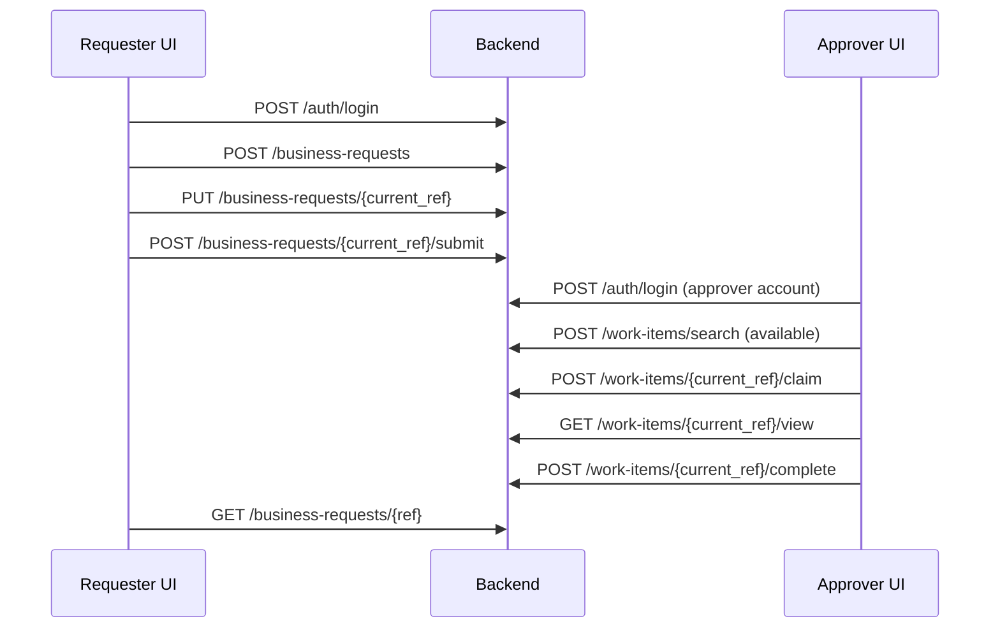

# Frontend walkthrough: sign in, submit, review, track

Audience: frontend developers and QA. Status: implemented HTTP contracts, with synthetic examples.
Reviewed: 2026-10-02. Language: English. Framework: neutral TypeScript.

[Documentation home](../Home.md) · [User handbook](user-handbook.md) ·
[Shared HTTP rules](frontend-contract.md) · [TypeScript client](../examples/frontend-client.ts) ·
[Request/response fixture](../examples/frontend-journey.json)

## Prerequisites and the example's limits

Run the backend and migrations using the [README](../../README.md). An administrator must prepare:

- A published form with a required string `amount` and a compatible published approval workflow.
  The small form in `tests/integration/test_processes.py::_published_form` demonstrates this contract.
- An active request type pointing to those definitions. Obtain its current `ref_id` from an
  administrator. `POST /api/v1/request-types/search` requires `requests.manage`; it is not a
  requester-facing catalog. Do not grant management rights just to implement a picker.
- Requester and reviewer accounts with `requests.start`, workflow start access for the requester,
  and current reviewer eligibility through the workflow's user/group assignments.
- For this example, a form/workflow that supports the legacy client context. A restricted client
  deployment needs its separately configured trusted session context; see
  [client identity](../architecture/client-context.md). Do not embed confidential client secrets
  in a browser bundle.

The fixture contains reviewed **synthetic** wire examples, not captured HTTP responses or a
database seed. Opaque references, tokens, usernames and passwords must be replaced with values
from your environment. `amount` is the example form's field, not a universal request field.
Real forms may require many other values; use their exact pinned contract.

The [workflow regressions](../testing/full-workflow-regression.md) now cover both the complex
service journey and this HTTP login-to-completion journey against newly migrated PostgreSQL.
The HTTP regression uses real ordinary users, roles, password checks and token sessions, with
no authentication dependency overrides. It runs in-process through ASGI; it does not start the
application lifespan or prove browser, reverse-proxy, S3, worker or telemetry operation.
Documentation tests validate the synthetic examples against current OpenAPI and selected DTOs;
the TypeScript example is checked with `tsc`. Keep these forms of evidence distinct.

### Administrator setup that must be explicit

Fresh migrations do not seed the `requests.start` permission. An authorized administrator must
create that permission, bind it to a role, and assign the role to both ordinary accounts. Verify
that each account's `POST /api/v1/auth/permissions/search` includes it. Creating a role whose
permission name does not exist is not proof of a working grant. See the admin routes in Swagger.
Development administrator seeding is described in the [README](../../README.md).

For this small example, use `START → HUMAN_TASK → FINISH`, assign the human step to the reviewer,
and route its `approve` outcome to `FINISH`. Publish both the form and workflow before making the
request type available. The human step's read/write/required field policies use
`/properties/amount`, **not** `/amount`.

Request data is not automatically copied into every human form. This example needs a task
contract with `inherit_previous: true`, an edit view exposing `/properties/amount`, and a
`complete` action with `outcome_key: approve`. Otherwise an unbound human form can open empty even
though the original request contains an amount. The executable setup in
[the HTTP regression](../../tests/integration/test_frontend_journey.py) supplies all of these
prerequisites; [task views](../api/task-views.md) describes the complete contract.

## Sequence



All paths in the diagram are prefixed by `/api/v1`. All bodies below are JSON. Send
`Authorization: Bearer <access_token>` after login. `Accept-Language: en` requests English.
For every member route, URL-encode the entire server-returned `ref_id` as one path segment.

## 1. Sign in

`POST /api/v1/auth/login` is unauthenticated. Body:

```json
{"username":"requester@example.test","password":"replace-with-your-password","device_name":"Documentation browser"}
```

HTTP 200 returns tokens in `data.access_token` and `data.refresh_token`; `data.expires_in` is in
seconds. See fixture step `login` for the complete response. The lifespan is configured by the
server; do not hardcode the fixture's example value. `GET /api/v1/auth/me` retrieves the profile.

```bash
curl --request POST 'http://localhost:8000/api/v1/auth/login' \
  --header 'Content-Type: application/json' --header 'Accept-Language: en' \
  --data '{"username":"requester@example.test","password":"replace-with-your-password","device_name":"Documentation browser"}'
```

Show credential failures without looping. A locked account (HTTP 423 / code 2003) requires a wait
or administrator help. Other relevant failures are 401 / 2001 for bad credentials and 422 / 1002
for invalid input. Refresh behavior and storage responsibilities are in the shared rules.

## 2. Create a draft

`POST /api/v1/business-requests` requires `requests.start` plus workflow/client eligibility.

```json
{"request_type_ref_id":"opaque-request-type","priority":5,"data":{"amount":"125.00"}}
```

HTTP 201 returns `SuccessResponse<BusinessRequestDTO>`; fixture step `create` contains every
required response field. Keep `data.ref_id` as the current request reference and render the
returned canonical `data.data`. The server pins form/workflow versions when the draft is created.
Priority is optional, from 0–9; its default comes from the request type or workflow.

Creation has no client idempotency key. Disable duplicate clicks. After an uncertain network
result, inspect your existing requests before sending another create operation.

## 3. Save before submitting

`PUT /api/v1/business-requests/{ref_id}` requires the requester, an editable draft, its origin client
and the current revision. The body is a replacement for the client-supplied draft data:

```json
{"priority":5,"data":{"amount":"125.00"}}
```

HTTP 200 returns a new request representation (fixture `save`). Replace the stored reference.
Serialize autosaves so responses cannot overwrite newer edits. On 409 / 1004, preserve local edits,
GET the current request, compare changes and ask the user to reconcile them. This PUT has no
idempotency key; do not blindly replay an uncertain save.

For complex forms, use the [behavior](../api/form-behavior.md), [dynamic options](../api/form-fields.md),
[localization](../api/form-localization.md), [client designs](../api/client-designs.md) and attachment
contracts. Collection edits and manual overrides have dedicated operations; they are not ordinary
array replacement. Reload the current request after an operation that does not return its new ref.

## 4. Submit exactly the saved draft

`POST /api/v1/business-requests/{ref_id}/submit` takes a key, not form data:

```json
{"submit_key":"purchase-submit-001"}
```

Generate one key per logical submit action and retain it for retries of that action. HTTP 200
returns the request (fixture `submit`). Full form and option validation runs before submission.
The server starts the process in the same transaction, so the returned request may already be
`RUNNING` or `COMPLETED`; do not require a visible `SUBMITTED` intermediate state.

Replaying the same key for the same saved submission is supported. Reusing a key with changed
data or another request can fail with 409 / 1004. Validation failure is 422 / 1002; domain failures
may include `data.issues` with pointers. Invalid DTO input can instead have `data: null`.

## 5. Find and claim the approval

Use a separate approver session. `POST /api/v1/work-items/search` requires `requests.start`:

```json
{"cartable":"available","page":1,"size":20}
```

HTTP 200 returns `result.items` and page metadata, not `data` (fixture `available`). Select a task
for this request using its returned association; the sample contains one item, but production may
contain many. Never assume the first task belongs to the request you just created. Treat refs as
opaque revision-bearing values; request reads and state changes can return newer refs.

`POST /api/v1/work-items/{ref_id}/claim` body:

```json
{"command_key":"purchase-claim-001"}
```

HTTP 200 returns the claimed task and its latest `ref_id` (fixture `claim`). Eligible membership
and the `OPEN` state are checked atomically. A competing claim can return 409 / 1004; an invisible
or ineligible task can return 404 / 1003. Refresh the list and explain that the task is unavailable.

## 6. Read the task view and act

`GET /api/v1/work-items/{ref_id}/view` returns the default pinned view (fixture `view`). Optional
query `key` selects a named view, maximum 64 characters. Use its filtered `data`, `render_schema`,
feedback and `actions`. Save the `work_item_ref_id` from this response for subsequent writes.
An observer or closed task has no actionable controls. A view's visibility does not grant a write.

For the sample, the action has `kind: complete` and `outcome_key: approve`:

```json
{"command_key":"purchase-approve-001","outcome_key":"approve","data":{"amount":"125.00"},"comment":"Reviewed the purchase amount.","feedback":[]}
```

Send it to `POST /api/v1/work-items/{ref_id}/complete`. HTTP 200 returns the closed work item
(fixture `complete`). Match the actual returned action's kind and outcome; do not hardcode approve
for arbitrary forms. `reject` and `return` use their respective endpoints with the same DTO shape.
Honor `confirmation`, `require_comment`, `required_scopes` and the validation profile.

`POST /api/v1/work-items/{ref_id}/save` takes `command_key` plus `data` for autosave. It does not
advance the workflow. Saves and actions need different keys; reusing a key with another payload
fails. The current claimant and field policy are rechecked. Keep a retry's original key and payload.
See [task views](../api/task-views.md) for corrections and read/write projection details.

## 7. Track the whole request

As the requester, `GET /api/v1/business-requests/{ref_id}` returns the current request (fixture
`track` illustrates final completion). Repeat review steps for all required approvals. Refresh
on return to the screen; use bounded polling only while the user is viewing active work, and
stop/back off on errors. The backend specifies no mandatory polling interval.

`POST /api/v1/business-requests/search` accepts `{"page":1,"size":20}` plus documented filters
and returns visible requests in `result.items`. A task's `COMPLETED` status does not prove the
whole request completed, nor does technical completion alone mean business approval.

The current BusinessRequestDTO does **not** expose a process ref. This guide therefore tracks the
request directly. Process detail/timeline routes require a real process ref obtained through an
authorized integration that already has it; never substitute a request or step-execution ref.
Do not call a generic process resume operation to bypass human-task completion.

## Screen behavior checklist

| State | Frontend behavior |
| --- | --- |
| Loading | Show progress, retain unsaved data, disable conflicting commands. |
| Empty available work | Show “No available tasks”; allow refresh. |
| Saving | Send one revision at a time; replace the current reference after success. |
| Validation error | Display a summary and available pointer messages; preserve the form. |
| Stale/competing edit | Refetch and reconcile; never silently overwrite. |
| Uncertain submit/action | Reconcile current state; retry only the same logical command with its saved key. |
| Session expired | Refresh once through a serialized refresh operation or sign in; stop retry loops. |
| Forbidden/not found | Explain access/unavailability without revealing another user's data. |
| Closed task | Read-only view; refresh request progress for the overall result. |

## Implementation and verification map

| Concern | Source / evidence |
| --- | --- |
| Session creation/rotation | [Auth routes](../../src/apps/users/presentation/login.py), [auth service](../../src/apps/users/application/auth_service.py) |
| Draft/submit rules | [Request service](../../src/apps/requests/application/service.py), [routes](../../src/apps/requests/presentation/routes.py) |
| Claim/actions/views | [Work service](../../src/apps/work_items/application/service.py), [routes](../../src/apps/work_items/presentation/routes.py) |
| Real HTTP journey and failure cases | [HTTP integration test](../../tests/integration/test_frontend_journey.py) |
| Full service journey | [Purchase integration test](../../tests/integration/test_full_workflow.py) |
| HTTP example contract and links | [Documentation tests](../../tests/docs/test_frontend_docs.py) |

Run the [documentation checks](documentation-maintenance.md) when changing this journey.
