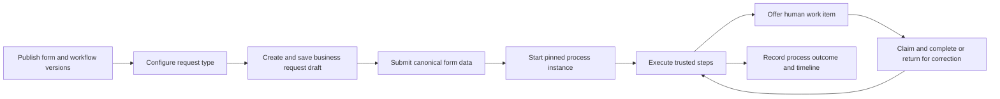

# Project and API overview

For plain-language tasks, start with the [user handbook](guides/user-handbook.md). Frontend
developers should follow the [HTTP walkthrough](guides/frontend-journey.md) and
[shared rules](guides/frontend-contract.md) before browsing individual response schemas.

This backend serves a versioned form and workflow system through FastAPI. Application modules
under `src/apps/` own their business data and HTTP routes; shared authentication, persistence,
history, localization and task infrastructure live under `src/core/` and `src/utils/`. The API
uses `/api/v1` for application routes. [Swagger, ReDoc and JSON/YAML OpenAPI](../README.md#-api-documentation)
are generated from the running application and are available in English and Farsi. The
[coverage inventory](api/openapi-coverage.md) shows the current operation and schema surface;
it is a documentation audit, not a substitute for the generated contract.

## Core vocabulary

| Term | Meaning and owner |
| --- | --- |
| User | An authenticated person or service actor. `apps.users` owns credentials, sessions, roles, permissions and audit records. |
| Work group | A set of currently eligible users for operational work. `apps.work_groups` owns membership; membership and application permissions serve different purposes. |
| Client and release | A registered application identity and its exact release. `apps.clients` records this context for a session; reported device headers do not grant client trust. See [client identity](architecture/client-context.md). |
| Form definition and version | A named form and a draft or immutable published document snapshot. `apps.forms` owns data validation and presentation metadata. See [versioned forms](architecture/forms.md). |
| Workflow definition and version | A named workflow and its authored graph snapshot. `apps.workflows` owns graph publication; `apps.step_types` owns trusted handler contracts. |
| Request type | A selectable starting rule connecting a workflow definition, form and eligibility. `apps.requests` owns the rule. |
| Business request | A user's draft or submitted case with pinned form/workflow references and canonical submitted data. `apps.requests` owns its lifecycle. |
| Process instance | The durable execution of a submitted request. `apps.processes` owns execution position, transition and event evidence; it does not edit published definitions. |
| Work item | An actionable human step offered to eligible users. `apps.work_items` owns claim, completion, correction and personal work state. |
| Definition library | Discovery and reuse of authored components, data types and subprocesses. `apps.designer` exposes dependencies and upgrade guidance; see the [library guide](api/definition-library.md). |

## How a case moves

Publication checks and snapshots the authored versions. Draft data may change before submission;
the running request uses pinned versions, so publishing a successor does not silently change an
active process. Work-item visibility and action eligibility are checked by the server at the time
of the action. A client should retain canonical JSON values and treat presentation labels as
display text. The [saved purchase-request scenario](testing/form-workflow-conformance.md) shows
these rules through a portable fixture and backend replay. The [form field guide](api/form-fields.md)
explains dynamic options, dependencies and client-side race handling.

## Module responsibilities

| Area | Source | Primary concern |
| --- | --- | --- |
| Identity and authorization | `src/apps/users`, `src/apps/work_groups` | Sessions, permissions, membership and audit. |
| Client identity | `src/apps/clients` | Registered clients, releases and session context. |
| Authoring | `src/apps/forms`, `src/apps/workflows`, `src/apps/step_types`, `src/apps/designer` | Data/render definitions, reusable artifacts, graph validation and publication. |
| Case and execution | `src/apps/requests`, `src/apps/processes`, `src/apps/work_items` | Draft/submission, durable execution and human decisions. |
| Integration and delivery | `src/apps/integrations`, `src/apps/notifications`, `src/apps/tasks` | Governed connections, notifications and background task execution. |
| Files and reports | `src/apps/media`, `src/apps/reporting` | Private user media and reporting queries. See [media policy](architecture/media-security.md). |

These directories have `domain`, `application`, `data` and `presentation` layers where needed.
Route handlers adapt HTTP to application services; entities and repositories own persistence.
The [route-linked inventory](api/openapi-coverage.json) identifies the handler for every
generated operation. For setup, migrations, local services, Swagger authorization and checks,
start with the [README](../README.md). For operational failure/recovery controls, see the
[BPMS safeguards](operations/bpms-safeguards.md).

## Client contract basics

- JSON request and response DTO fields use `snake_case`. Opaque `ref_id` values include revision
  information; clients should pass current references back for guarded mutations rather than
  constructing or editing them. See [reference handling](api/client-designs.md).
- The server enforces user permissions, current group membership, resource visibility and client
  restrictions. A rendered control's visibility is not authorization. See
  [client identity](architecture/client-context.md) and [form behavior](api/form-behavior.md).
- Forms have canonical data separate from render, behavior, localization and client view metadata.
  A client can be data-only; no particular frontend stack is part of the wire contract. See
  [localization](api/form-localization.md) and [client views](api/client-designs.md).
- HTTP `Date` is optional diagnostic input; browsers cannot set it. Server workflow and token
  decisions use trusted server state. See [client Date diagnostics](api/client-date-diagnostics.md).
- File and image downloads are private authenticated operations. The
  [private media download contract](api/private-media-downloads.md) describes the optional
  Content-Disposition request preference and fixed no-store response policy.

## Documentation status

The [documentation home](Home.md) links the implemented contracts and generated response DTO reference. The [full workflow roadmap](roadmap/full-workflow.md) defines the combined purchase approval case for the future Angular frontend. The [core purchase regression](testing/full-workflow-regression.md) now combines form interactions and two human approval subprocesses in a disposable database. AI, parallel and external delivery stages still need one combined replay; browser validation remains future work.
