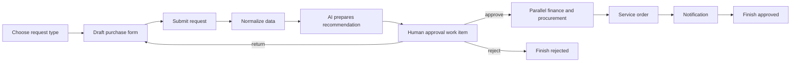

# Full workflow for frontend design

This is the frontend design path for one purchase request that exercises the backend's major contracts. The [saved purchase-request vector](../testing/form-workflow-conformance.md) supplies canonical form data, English/Farsi text, client context, reuse, correction rounds and approval expectations. The example below adds a human approval checkpoint after AI preparation, as requested for important work. The [core backend journey](../testing/full-workflow-regression.md) now replays the saved form case and runs form publication, typed transformation, two human approval subprocesses and version pinning in one disposable database. AI preparation, parallel branches and external delivery remain separate scenario coverage until they are added to that journey.

## Target journey



The important decision is the `HUMAN_TASK` after the AI step. Its outcome is an explicit user action. The AI output may prepare text or structured data for review; it must not turn a recommendation into an approval. The frontend must display the pinned input, proposed output, sources or tool results, and the human's selected action and comment. The backend rechecks access and current version on action, even when a control is visible in the UI.

## Build order and evidence

| Stage | Backend artifact and API | Frontend surface | Proof before moving on |
| --- | --- | --- | --- |
| 1 | Select published step types, form versions, workflow versions, library components/data types/subprocesses, and usable connections from their `/select` endpoints. | Searchable resource picker showing name, version and access state. | A selected opaque `key` is sent unchanged; empty and out-of-range pages work. |
| 2 | Create form root/version; save Draft 2020-12 data schema, `bpms.render/1` document, behavior, localization and reuse pins. | Form editor and preview with English/Farsi, conditional fields and repeated line items. | Replay `purchase-request-v1.json`; compare canonical data, resolved labels, validation paths and option generation. |
| 3 | Create workflow root/version; save a small `START → TRANSFORM → HUMAN_TASK → FINISH` graph. | Canvas, property inspector, typed bindings and validation panel. | The graph validator reports no issues; publication returns checksum and exact version ref. |
| 4 | Create a request type tying the workflow root and start form root to allowed clients. | Request catalog and start page. | The user sees only eligible request types and the server rejects an unauthorized start. |
| 5 | Create/save/submit a request with one stable `submit_key`. | Draft, attachment picker, review and submit screens. | Replaying the same submit key returns the same request; a different stale ref is rejected. |
| 6 | Add AI preparation, then required human review. Pin an approved AI agent/tool and a human form with approve, return and reject actions. | Recommendation panel, evidence and approval work item. | The process waits until an eligible user acts; AI completion alone cannot approve. |
| 7 | Add parallel finance/procurement branches, a reusable child approval, decision conditions, timer/event waits, service task, notification and compensation path. | Branch/join canvas, dependency explorer, retries and failure routes. | Run each branch and failure mode on a disposable migrated database; inspect tokens and timeline. |
| 8 | Publish a successor form/workflow while a request is active. | Version comparison, migration guidance and read-only runtime snapshot. | Active request keeps its original form, graph and child pins; new requests may use the successor. |

## Minimal working graph

The backend integration test `test_runtime_executes_once_and_invalid_resume_never_advances` in `tests/integration/test_processes.py` proves a `START → TRANSFORM → FINISH` flow. Its graph has this shape; replace `<step-version-ref>` values with keys from `POST /api/v1/step-types/select` before saving:

```json
{
  "steps": [
    {"key": "start", "type_code": "START", "type_version_ref": "<start-step-version-ref>"},
    {"key": "convert", "type_code": "TRANSFORM", "type_version_ref": "<transform-v2-ref>", "config": {"conversion_key": "integer"}},
    {"key": "finish", "type_code": "FINISH", "type_version_ref": "<finish-step-version-ref>"}
  ],
  "bindings": [
    {
      "step": "convert", "target_port": "value", "target_schema": {"type": ["string", "integer"]},
      "source_kind": "REQUEST", "source_path": "/amount",
      "source_schema": {"type": "object", "properties": {"amount": {"type": "string"}}}
    }
  ],
  "targets": [],
  "transitions": [
    {"source": "start", "target": "convert", "outcome": "next", "is_default": true},
    {"source": "convert", "target": "finish", "outcome": "next", "is_default": true}
  ]
}
```

Save with `PUT /api/v1/workflow-versions/{ref_id}/graph`, validate the draft, then publish with `POST /api/v1/workflow-versions/{ref_id}/publish`. Graph steps also support `flow`, `form_ref`, `field_policy`, `task_contract`, `subprocess`, priority and timeout. The [workflow graph DTO reference](../reference/responses/workflow-versions.md) gives the response shape; the generated Swagger schema gives required request fields.

## Human approval contract

This is a valid `HumanTaskContract` shape for a review step. The actual graph step also needs a published form ref, the `HUMAN_TASK` step version ref, a `HumanConfig.form_version_ref`, field policy, candidate target and outcome transitions. These references come from the authorized selectors and must be resolved by the server at save and execution time.

```json
{
  "default_view": "review",
  "views": [
    {"key": "review", "purpose": "edit", "title": {"en": "Approve purchase", "fa": "تأیید خرید"}, "scopes": ["/amount", "/justification"]},
    {"key": "summary", "purpose": "summary", "title": {"en": "Purchase summary"}, "scopes": ["/amount", "/justification"]}
  ],
  "actions": [
    {"key": "approve", "kind": "complete", "outcome_key": "approve", "title": {"en": "Approve", "fa": "تأیید"}, "required_scopes": ["/amount"]},
    {"key": "return", "kind": "return", "outcome_key": "return", "title": {"en": "Return for correction", "fa": "بازگشت برای اصلاح"}, "require_comment": true},
    {"key": "reject", "kind": "reject", "outcome_key": "reject", "title": {"en": "Reject", "fa": "رد"}, "require_comment": true}
  ]
}
```

The corresponding request type creation body has the actual wire fields:

```json
{
  "code": "PURCHASE_APPROVAL",
  "name": "Purchase approval",
  "workflow_ref_id": "<published-workflow-root-ref>",
  "form_ref_id": "<published-start-form-root-ref>",
  "is_active": true,
  "allow_cross_client_resume": false
}
```

The request begins with `POST /api/v1/business-requests` body `{"request_type_ref_id":"<request-type-ref>","data":{"amount":"42"}}`. Submit with `POST /api/v1/business-requests/{ref_id}/submit` body `{"submit_key":"purchase-2026-001"}`. Keep the server-returned `ref_id` for the next mutation. The request and process responses use the shared success envelope; pages use `result.items`. Use `Accept-Language: fa` to test localized labels without changing canonical keys.

## Frontend design decisions to make from the working flow

1. Keep canonical values, localized presentation and pinned revision metadata separate in client state. Display the server's validation JSON pointers next to the matching controls.
2. Offer selector search before loading full libraries. Store `key` as the submitted value and `value` only for display. Show exact version numbers where pins matter.
3. Treat graph validation as the save/publish gate. Show issue pointer, code, expected/actual schema and relevant step/port; do not guess port compatibility in the browser.
4. Display all current process positions and human assignments. Parallel paths can produce more than one active position. Show the append-only timeline for audit and support.
5. Preserve draft edits and idempotency keys across retries. A correction round creates new state; an old form response or stale ref must not overwrite it.
6. Keep media private: user images/files require authenticated fetches, no shared cache, and only the allowed Content-Disposition preference is client-controlled.
7. Build recovery views for timeout, failed external service, notification retry, compensation and manual work reassignment. Use explicit backend states rather than optimistic visual completion.

## Acceptance for the combined example

A disposable Compose run should create and publish all referenced definitions, start one case, exercise approve/return/reject, show AI preparation blocked on human approval, traverse parallel branches, complete a service call and notification, and preserve a pinned in-flight version while successors publish. Capture the HTTP requests/responses and timeline as a fixture. Then run the same fixture through the Angular client and compare canonical data and actions. The core form-to-approval journey has one combined regression test. The AI, parallel and external delivery stages still need to be added before the broader diagram is a verified single-case replay.
